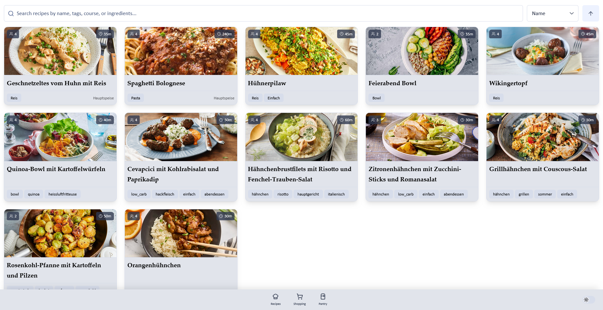

# cooklang-web

A web server for managing [Cooklang](https://cooklang.org/) recipes, shopping lists, and pantries. Built with SvelteKit and designed to help you organize your cooking workflow. Cooklang is a markup language for cooking recipes that allows you to define ingredients, cookware, and timers in a structured format.



### Features

- **Recipe Management**: Store, view, and manage your cooklang recipes
- **Shopping Lists**: Generate and manage shopping lists from your recipes
- **Pantry Tracking**: Keep track of ingredients you have on hand

## Tech Stack

- **Framework**: [SvelteKit](https://kit.svelte.dev/) - Full-stack web framework
- **UI Components**: [Skeleton UI](https://www.skeleton.dev/) - Tailwind-based component library
- **Styling**: [Tailwind CSS](https://tailwindcss.com/) v4
- **Icons**: [Lucide Svelte](https://lucide.dev/)
- **i18n**: [Paraglide JS](https://inlang.com/m/gerre34r/library-inlang-paraglideJs) - Type-safe internationalization
- **Deployment**: Node.js adapter for production deployment

## Development

### Prerequisites

- Node.js (LTS version recommended)
- npm, pnpm, or yarn

### Setup

Install dependencies:

```sh
npm install
```

### Running the Development Server

Start the development server with hot module replacement:

```sh
npm run dev
```

### Type Checking

Run TypeScript and Svelte type checking:

```sh
npm run check
```

Or run in watch mode:

```sh
npm run check:watch
```

## Building

Create a production build:

```sh
npm run build
```

Preview the production build locally:

```sh
npm run preview
```
